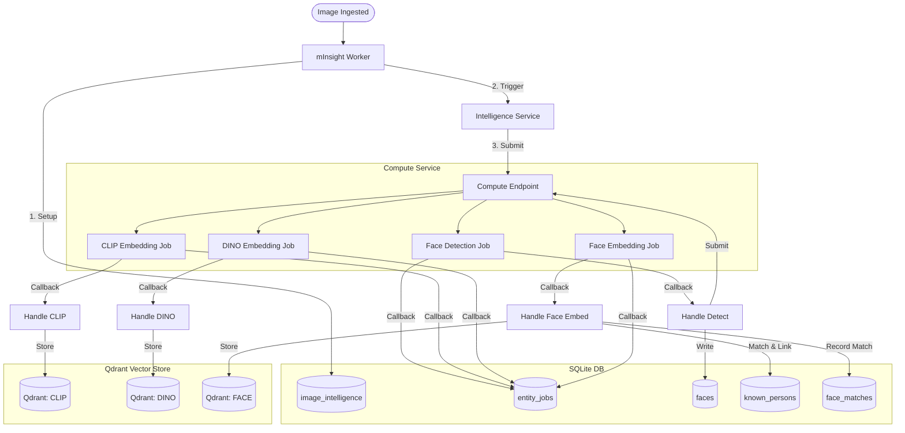

# mInsight Intelligence Architecture

This document describes the end-to-end workflow for image intelligence processing in the mInsight system, covering face detection, face recognition, and multi-model embeddings (CLIP and DINOv2).

## Image Intelligence Workflow

The following diagram and table detail the interaction between the Store service, the Compute endpoint, and the persistence layers (SQLite and Qdrant).

### Sequence of Events

### Process & Data Flow

| Step              | Process                          | Action                             | Data Store Updated                                                  |
| :---------------- | :------------------------------- | :--------------------------------- | :------------------------------------------------------------------ |
| **1. Enqueue**    | `_enqueue_image`                 | Initialize status                  | `image_intelligence` (SQLite)                                       |
| **2. Trigger**    | `trigger_async_jobs`             | Submit 3 jobs (Detect, CLIP, DINO) | `entity_jobs` (SQLite)                                              |
| **3. Detection**  | `handle_face_detection_complete` | Save faces & Trigger embedding     | `faces` (SQLite), `entity_jobs` (SQLite)                            |
| **4. CLIP Embed** | `handle_clip_embedding_complete` | Save vector                        | `Qdrant: CLIP` collection                                           |
| **5. DINO Embed** | `handle_dino_embedding_complete` | Save vector                        | `Qdrant: DINO` collection                                           |
| **6. Face Embed** | `handle_face_embedding_complete` | Recognition & Save vector          | `known_persons`, `face_matches` (SQLite), `Qdrant: FACE` collection |
